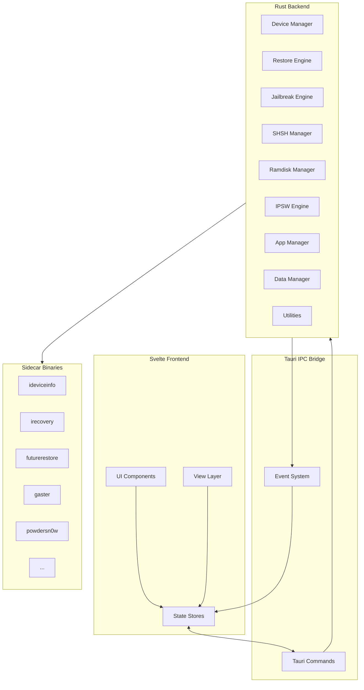
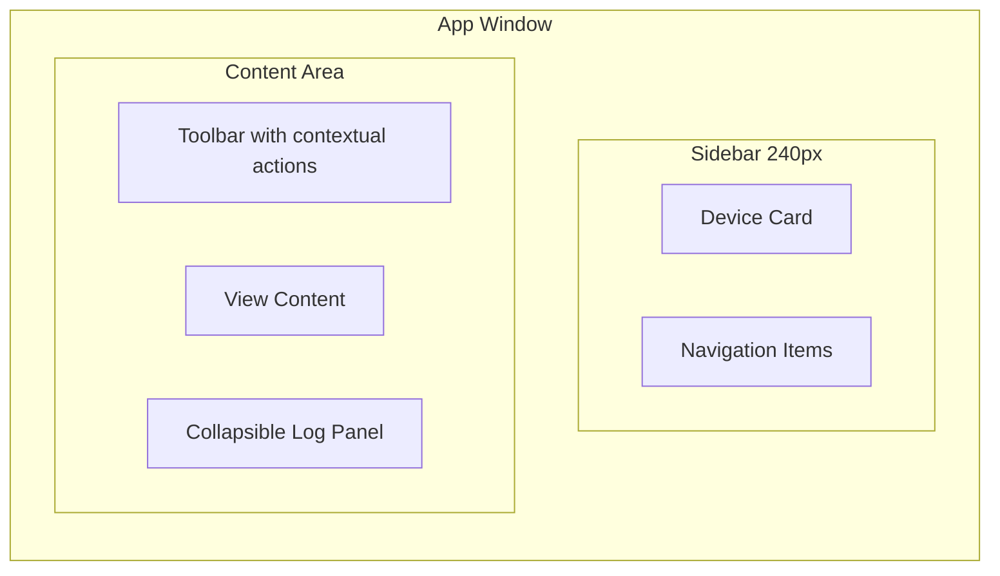
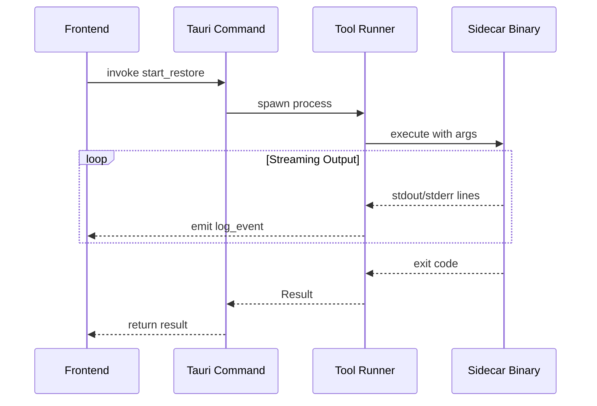

# Legacy iOS Kit — UI Rebuild Plan

## Executive Summary

Rebuild Legacy iOS Kit from a 12,165-line monolithic bash script (`restore.sh`) into a cross-platform desktop application with a native-feeling GUI. The new app will use **Tauri v2** (Rust backend) with a **Svelte 5 + TypeScript** frontend, targeting **macOS and Linux** (x86_64 + arm64).

---

## Technology Stack

| Layer | Technology | Rationale |
|-------|-----------|-----------|
| **App Framework** | Tauri v2 | First-class sidecar binary support, small footprint ~10MB, native OS integration, async Rust backend |
| **Backend** | Rust | Excellent process management, async I/O, type safety, direct USB/file ops |
| **Frontend** | Svelte 5 + TypeScript | Lightweight, minimal boilerplate, reactive by default, fast builds |
| **Styling** | CSS with macOS design tokens | Apple HIG-inspired, system fonts, translucent sidebars, native vibrancy |
| **Bundled Tools** | Existing CLI binaries via Tauri sidecars | ideviceinfo, irecovery, futurerestore, gaster, powdersn0w, etc. |
| **Build** | Cargo + Vite | Standard Tauri v2 toolchain |

---

## Architecture Overview



---

## Project Structure

```
legacykit/
├── src-tauri/                    # Rust backend
│   ├── src/
│   │   ├── main.rs              # Entry point
│   │   ├── lib.rs               # Module declarations
│   │   ├── state.rs             # Global app state
│   │   ├── error.rs             # Error types
│   │   ├── platform.rs          # OS detection, path resolution
│   │   │
│   │   ├── commands/            # Tauri command handlers - invoked from frontend
│   │   │   ├── mod.rs
│   │   │   ├── device.rs        # detect_device, get_device_info, pair_device
│   │   │   ├── restore.rs       # start_restore, get_restore_options
│   │   │   ├── jailbreak.rs     # start_jailbreak, get_jailbreak_options
│   │   │   ├── shsh.rs          # save_blobs, list_blobs, convert_blobs
│   │   │   ├── ramdisk.rs       # boot_ramdisk, ramdisk_commands
│   │   │   ├── ipsw.rs          # download_ipsw, prepare_ipsw, verify_ipsw
│   │   │   ├── apps.rs          # install_ipa, dump_apps, sideload
│   │   │   ├── data.rs          # backup, restore_backup, mount, erase
│   │   │   └── utilities.rs     # misc utilities, activation, DFU helper
│   │   │
│   │   ├── tools/               # Wrappers for external CLI binaries
│   │   │   ├── mod.rs
│   │   │   ├── runner.rs        # Generic process runner with streaming output
│   │   │   ├── idevice.rs       # ideviceinfo, idevicepair, idevicediagnostics, etc.
│   │   │   ├── irecovery.rs     # irecovery wrapper
│   │   │   ├── futurerestore.rs # futurerestore orchestration
│   │   │   ├── gaster.rs        # gaster/checkm8 exploit
│   │   │   ├── powdersn0w.rs    # powdersn0w IPSW creation
│   │   │   ├── img4.rs          # img4, img4tool, img3maker
│   │   │   ├── tsschecker.rs    # SHSH blob saving
│   │   │   ├── ssh.rs           # SSH/SCP operations
│   │   │   └── ipsw_tool.rs     # IPSW extraction, patching
│   │   │
│   │   ├── models/              # Data structures
│   │   │   ├── mod.rs
│   │   │   ├── device.rs        # DeviceInfo, DeviceMode, DeviceType
│   │   │   ├── firmware.rs      # FirmwareVersion, IPSW, BuildManifest
│   │   │   ├── shsh.rs          # SHSHBlob, APTicket
│   │   │   └── restore.rs       # RestoreConfig, RestoreProgress
│   │   │
│   │   └── services/            # Business logic orchestration
│   │       ├── mod.rs
│   │       ├── device_detection.rs  # USB polling, mode detection
│   │       ├── firmware_keys.rs     # Firmware key fetching/caching
│   │       ├── download.rs          # aria2c download management
│   │       └── dependency.rs        # Tool availability checks
│   │
│   ├── binaries/                # Platform-specific sidecar binaries
│   │   ├── macos/
│   │   │   ├── x86_64/
│   │   │   └── arm64/
│   │   └── linux/
│   │       ├── x86_64/
│   │       └── arm64/
│   │
│   ├── resources/               # Patches, manifests, payloads from existing resources/
│   ├── Cargo.toml
│   └── tauri.conf.json
│
├── src/                         # Svelte frontend
│   ├── app.html
│   ├── app.css                  # Global styles, macOS design tokens
│   ├── main.ts
│   ├── App.svelte               # Root component with layout
│   │
│   ├── lib/
│   │   ├── components/          # Reusable UI components
│   │   │   ├── layout/
│   │   │   │   ├── Sidebar.svelte         # macOS-style translucent sidebar
│   │   │   │   ├── ContentArea.svelte     # Main content region
│   │   │   │   ├── Toolbar.svelte         # Top toolbar
│   │   │   │   └── StatusBar.svelte       # Bottom status bar
│   │   │   │
│   │   │   ├── device/
│   │   │   │   ├── DeviceCard.svelte      # Device info display card
│   │   │   │   ├── DeviceStatus.svelte    # Connection status indicator
│   │   │   │   └── DFUHelper.svelte       # Visual DFU mode guide
│   │   │   │
│   │   │   ├── common/
│   │   │   │   ├── Button.svelte
│   │   │   │   ├── Select.svelte
│   │   │   │   ├── Modal.svelte
│   │   │   │   ├── Toast.svelte
│   │   │   │   ├── ProgressBar.svelte
│   │   │   │   ├── Terminal.svelte        # Live log/output viewer
│   │   │   │   ├── FilePickerButton.svelte
│   │   │   │   └── ConfirmDialog.svelte
│   │   │   │
│   │   │   └── wizard/
│   │   │       ├── WizardContainer.svelte # Multi-step wizard wrapper
│   │   │       ├── WizardStep.svelte      # Individual step
│   │   │       └── WizardProgress.svelte  # Step indicator
│   │   │
│   │   ├── views/               # Page-level views mapped to sidebar nav
│   │   │   ├── HomeView.svelte            # Device overview, quick actions
│   │   │   ├── RestoreView.svelte         # Restore/downgrade wizard
│   │   │   ├── JailbreakView.svelte       # Jailbreak workflow
│   │   │   ├── SHSHView.svelte            # Blob management
│   │   │   ├── AppManageView.svelte       # App install/dump/sideload
│   │   │   ├── DataManageView.svelte      # Backup/restore/mount
│   │   │   ├── UtilitiesView.svelte       # Misc and useful utilities
│   │   │   ├── SSHRamdiskView.svelte      # SSH ramdisk operations
│   │   │   ├── SettingsView.svelte        # App preferences, flags
│   │   │   └── LogView.svelte             # Full session log viewer
│   │   │
│   │   ├── stores/              # Svelte 5 runes-based state
│   │   │   ├── device.svelte.ts           # Device state, connection
│   │   │   ├── operation.svelte.ts        # Current operation progress
│   │   │   ├── log.svelte.ts              # Log buffer
│   │   │   ├── settings.svelte.ts         # User preferences
│   │   │   └── navigation.svelte.ts       # Current view routing
│   │   │
│   │   ├── api/                 # Tauri command wrappers - typed TS functions
│   │   │   ├── device.ts
│   │   │   ├── restore.ts
│   │   │   ├── jailbreak.ts
│   │   │   ├── shsh.ts
│   │   │   ├── ipsw.ts
│   │   │   ├── apps.ts
│   │   │   ├── data.ts
│   │   │   └── utilities.ts
│   │   │
│   │   └── utils/               # Frontend utilities
│   │       ├── formatting.ts
│   │       └── platform.ts
│   │
│   └── assets/
│       ├── icons/
│       └── images/
│
├── resources/                   # Existing resources directory
├── package.json
├── svelte.config.js
├── vite.config.ts
└── tsconfig.json
```

---

## UI Layout Design



### Sidebar Navigation Items

Mapped from the current `menu_main` options:

| Icon | Label | Maps to current function |
|------|-------|--------------------------|
| 🏠 | Home | Device overview and quick actions |
| ⬇️ | Restore | `menu_restore` — Restore/Downgrade wizard |
| 🔓 | Jailbreak | `device_jailbreak_confirm` |
| 💾 | SHSH Blobs | `menu_shsh` — Save/manage blobs |
| 🖥️ | SSH Ramdisk | `menu_ramdisk` |
| 📱 | Apps | `menu_appmanage` + `menu_ipa` — Sideload/manage |
| 📦 | Data | `menu_datamanage` — Backup/restore |
| 🔧 | Utilities | `menu_miscutilities` + `menu_usefulutilities` |
| ⚙️ | Settings | CLI flags like `--jailbreak`, `--disable-bbupdate`, etc. |

### Key UI Patterns

1. **Device Card** — Always visible at sidebar top; shows device name, type, iOS version, mode, ECID. Maps to `menu_print_info`.

2. **Wizard Flows** — Complex operations like Restore become multi-step wizards instead of nested menus:
   - Step 1: Select target version - replaces `menu_restore` version list
   - Step 2: Select IPSW source - replaces `menu_ipsw_browse`
   - Step 3: Configure options such as jailbreak, baseband, etc. — replaces `ipsw_preference_set`
   - Step 4: Review and confirm
   - Step 5: Execute with live progress

3. **Terminal Panel** — Collapsible bottom panel showing real-time output from CLI tools. Replaces the raw terminal output users currently see.

4. **Progress Tracking** — Downloads, IPSW preparation, and restores show proper progress bars with stage indicators.

5. **DFU Helper** — Visual guide with device illustrations and step-by-step button timing, replacing the text-based `device_dfuhelper`.

---

## Functional Domain Mapping

### Device Detection → `commands/device.rs`

Current shell functions to reimplement:
- `device_get_info` → `detect_device` Tauri command
- `device_get_name` → Lookup table in `models/device.rs`
- `device_manufacturing` → Serial number parsing
- `device_find_mode` → USB polling with timeout
- `device_entry` → Manual device entry dialog

Key behavior: Poll for device connection using ideviceinfo and irecovery on interval. Emit Tauri events when device state changes.

### Restore/Downgrade → `commands/restore.rs`

Current shell functions to reimplement:
- `menu_restore` → `get_restore_options` returns available versions for detected device
- `ipsw_download` → Managed download with progress events
- `ipsw_prepare_*` — All 50+ IPSW patching/creation functions
- `restore_prepare` → Pre-restore device preparation
- `restore_idevicerestore` / `restore_futurerestore` → Execute restore with streaming output

### Jailbreak → `commands/jailbreak.rs`

Current shell functions:
- `device_jailbreak_confirm` → Compatibility check + confirmation UI
- `device_jailbreak` → Execute via ramdisk
- `device_jailbreak_gilbert` → g1lbertJB execution

### SHSH Blobs → `commands/shsh.rs`

Current shell functions:
- `shsh_save` → Save via tsschecker
- `shsh_save_onboard` / `shsh_save_onboard64` → Dump from device
- `shsh_save_cydia` → Fetch from Cydia servers
- `shsh_convert_onboard` → Format conversion

### SSH Ramdisk → `commands/ramdisk.rs`

Current shell functions:
- `device_ramdisk` / `device_ramdisk64` → Boot ramdisk
- `menu_ramdisk` → Ramdisk command menu becomes a view with action buttons

### App Management → `commands/apps.rs`

Current shell functions:
- `device_ideviceinstaller` → List/install apps
- `device_dumpapp` → Dump IPA files
- `device_sideloader` → Sideload via AltServer/Sideloader
- `menu_ipa` → IPA file picker + install

### Data Management → `commands/data.rs`

Current shell functions:
- `device_backup_create` / `device_backup_restore` → idevicebackup2
- `device_erase` → Erase all content
- SSH/mount operations

### Utilities → `commands/utilities.rs`

Current shell functions:
- `device_activate` / `device_hacktivate` → Activation
- `device_enter_mode` → Enter recovery/DFU/kDFU/pwnDFU
- `device_dfuhelper` → DFU mode helper with visual guide
- Clear NVRAM, shutdown, restart, etc.

---

## Tool Runner Architecture

The core pattern for executing sidecar binaries:



The `tools/runner.rs` module provides:
- Async process spawning with Tauri sidecar resolution
- Real-time stdout/stderr streaming via Tauri events
- Cancellation support
- Timeout handling
- Platform-specific binary path resolution - macOS vs Linux, x86_64 vs arm64

---

## Implementation Phases

### Phase 1: Foundation (COMPLETED)
- [x] Initialize Tauri v2 + Svelte 5 project
- [x] Set up project structure and build system
- [x] Implement platform detection and binary path resolution
- [x] Create the tool runner module for executing sidecar binaries
- [x] Build the macOS-native CSS design system with tokens and base components
- [x] Create the app shell layout: sidebar, content area, toolbar, status bar
- [x] Implement the Device Card component with connection status
- [x] Port sidecar binaries (`bin/*`) to Tauri directory structure

### Phase 2: Device Detection and Core UI (NEXT UP)
- [ ] Create `commands/device.rs` to implement `detect_device` using `ideviceinfo` and `irecovery` tools
- [ ] Build device state management using Svelte 5 `$state` and Tauri events
- [ ] Implement periodic polling (or udev/fsevents triggers) for device hotplug detection
- [ ] Create the Home view component for device overview and quick actions
- [ ] Implement navigation routing between views
- [ ] Build the Terminal component for streaming log output from `runner.rs`
- [ ] Create the Settings view for managing CLI flags and preferences

### Phase 3: Restore and Downgrade
- Port device compatibility and version option logic from `menu_restore`
- Implement IPSW download manager with progress tracking via aria2c
- Build IPSW verification using SHA1 checks
- Create the Restore wizard view with multi-step flow
- Implement futurerestore and idevicerestore tool wrappers
- Port restore preparation logic from `restore_prepare` and `restore_deviceprepare`
- Implement IPSW preparation pipeline: `ipsw_prepare_32bit`, `ipsw_prepare_powder`, etc.

### Phase 4: Jailbreak and SSH Ramdisk
- Implement gaster and checkm8 exploit wrappers
- Port ramdisk boot logic for 32-bit and 64-bit devices
- Build the Jailbreak view with compatibility checks and guided flow
- Create the SSH Ramdisk view with action buttons for ramdisk commands
- Implement DFU Helper with visual step-by-step guide and button timing
- Port kloader, pwned iBSS/iBEC logic

### Phase 5: SHSH Blob Management
- Implement tsschecker wrapper for blob saving
- Port onboard blob dumping for 32-bit and 64-bit
- Build SHSH view with blob browser, save actions, and conversion
- Implement Cydia server blob fetching

### Phase 6: App and Data Management
- Implement IPA install/sideload via ideviceinstaller and Sideloader
- Build app dump functionality via Clutch
- Create App Management view with file picker and app list
- Implement backup/restore via idevicebackup2
- Build Data Management view with backup browser and actions
- Port mount and erase functionality

### Phase 7: Utilities and Polish
- Port all misc utilities: activation, hacktivation, DFU enter, recovery exit
- Build Utilities view as an organized grid of actions
- Implement TrollStore installation flow
- Add comprehensive error handling and user-friendly error messages
- Implement update checker and about dialog
- Final UI polish, animations, accessibility review
- Platform testing: macOS x86_64, macOS arm64, Linux x86_64, Linux arm64

### Phase 8: Packaging and Distribution
- Configure Tauri bundler for .dmg on macOS and .deb/.AppImage on Linux
- Bundle all sidecar binaries per platform and architecture
- Bundle resources directory with patches, manifests, and payloads
- Set up CI/CD pipeline for automated builds
- Write user documentation and migration guide from CLI

---

## Design System — macOS Native Feel

### Core Principles
- Use `-apple-system, BlinkMacSystemFont` font stack; fall back to system fonts on Linux
- Translucent sidebar using Tauri window vibrancy APIs on macOS
- Consistent 8px spacing grid
- SF Symbols-style iconography where possible
- Respect light/dark mode via `prefers-color-scheme`
- Subtle shadows and rounded corners matching macOS conventions

### Color Tokens

```css
:root {
  --color-accent: #007AFF;
  --color-success: #34C759;
  --color-warning: #FF9500;
  --color-danger: #FF3B30;
  --color-bg-primary: #FFFFFF;
  --color-bg-secondary: #F5F5F7;
  --color-bg-sidebar: rgba(246, 246, 246, 0.8);
  --color-text-primary: #1D1D1F;
  --color-text-secondary: #86868B;
  --color-border: #D2D2D7;
  --radius-sm: 6px;
  --radius-md: 10px;
  --radius-lg: 14px;
}

@media (prefers-color-scheme: dark) {
  :root {
    --color-bg-primary: #1C1C1E;
    --color-bg-secondary: #2C2C2E;
    --color-bg-sidebar: rgba(44, 44, 46, 0.8);
    --color-text-primary: #F5F5F7;
    --color-text-secondary: #98989D;
    --color-border: #38383A;
  }
}
```

---

## Key Technical Decisions

| Decision | Choice | Reasoning |
|----------|--------|-----------|
| Binary execution model | Tauri sidecars | First-class support, automatic path resolution per platform |
| Device polling | Periodic ideviceinfo/irecovery checks | Simple, reliable, same approach as current script |
| Frontend routing | Svelte store-based, no router lib | Single-window app with sidebar nav, no URL routing needed |
| State management | Svelte 5 runes with $state | Built-in reactivity, no external state lib needed |
| IPC pattern | Tauri commands + events | Commands for request/response, events for streaming |
| Error handling | Rust Result types mapped to typed frontend errors | Consistent error display with actionable messages |
| Resource bundling | Tauri resource API | Patches, manifests, payloads bundled in app |
| Log persistence | Write to ~/Library/Logs or ~/.local/share | Persistent logs for troubleshooting |

---

## Risk Considerations

1. **Binary compatibility** — Existing binaries in `bin/` must be tested in Tauri sidecar context. Some may need recompilation.
2. **Sudo operations** — Some operations require root. Tauri can prompt via `pkexec` on Linux or `osascript` on macOS.
3. **USB device access** — Linux may need udev rules, currently handled by `install_udev_rules`. App should detect and prompt.
4. **IPSW preparation complexity** — The 50+ `ipsw_prepare_*` functions represent deeply intricate patching logic that must be carefully ported.
5. **12K lines of battle-tested logic** — The bash script has years of edge-case handling. Rust rewrite must preserve this knowledge.
